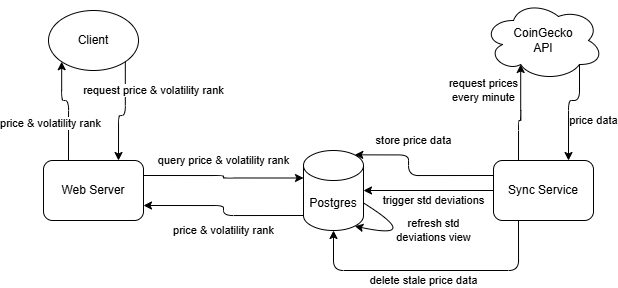
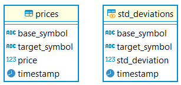

# Crypto Service

A service for current and daily cryptocurrency prices.

## Usage

### Running Locally

**Pre-requisites**

- [Node](https://nodejs.org/en/learn/getting-started/how-to-install-nodejs) (tested on 18.x)
- PostgreSQL or Docker

**Installation**

Run `npm install` in the root of the repository.

**Run Application**

1. Start database
   `npm run db` (This will start a docker container running postgres exposed on port 5678.)
   Otherwise, to use an existing postgres instance, configure connection environment variables in `.env`
2. Create schema
   `npm run createSchema`
   This will create the required tables/views in the postgres database.
3. Start data sync service
   `npm run syncService`
   This will start a Node process to sync data from CoinGecko to the database.
4. Start web server
   `npm start`
   This will start a Node web server listening on port `3000` (port can be changed in `.env`).

**Run Tests**

1. Start database (if not already running)
   `npm run db`
2. Run tests
   `npm test`

Each test file will create a temporary database and drop it after the tests complete. This keeps test data isolated and predictable. The `sync-service` tests allow actual API requests to CoinGecko rather than intercepting and responding with mock responses. This is intentional to validate that our assumptions about the API are still valid.

### Requesting Data

1. Volatilities
   `GET /volatilities/{base_symbol}/{target_symbol}`

#### Prices Endpoint

`GET /prices/{base_symbol}/{target_symbol}?limit={n}`

**Parameters:**

- `base_symbol`: crypto coin symbol
- `target_symbol`: price currency symbol
- `limit`: (optional) integer to limit number of data points to return

**Response:**

```json
[
  {
    "price": 98891,
    "timestamp": "2024-11-23T08:06:38.656Z"
  },
  {
    "price": 99016,
    "timestamp": "2024-11-23T08:00:22.335Z"
  },
  ...
]
```

**Examples:**

- Get current price for pair: `btc/usd`

```
GET http://localhost:3000/prices/btc/usd?limit=1
```

- Get collected prices in the last 24 hours for pair: `btc/eth`

```
GET http://localhost:3000/prices/btc/eth
```

#### Volatilities Endpoint

`GET /volatilities/{base_symbol}/{target_symbol}`

**Parameters:**

- `base_symbol`: crypto coin symbol
- `target_symbol`: price currency symbol

**Response:**

```json
{
  "std_deviation": 3.5467,
  "volatility_rank": 9,
  "timestamp": "2024-11-23T06:28:04.277Z"
}
```

**Example:**

Get volatility rank for pair: `btc/usd`

```
GET http://localhost:3000/volatilities/btc/usd
```

### Configuration

The service is configured using environment variables. When running locally, these are loaded from the `.env` file in the root of the repository. The following options are available:

- `PORT`
  Set the port the web-server will listen on
  Default: `3000`
- `COIN_GECKO_API_KEY`
  The API Key to use when calling CoinGecko APIs
- `CRYPTO_EXCHANGE_ID`
  The crypto exchange to get the list of coins to support
  Default: `binance`
- `TIME_WINDOW`
  The time window over which to store price data specified using [PostgreSQL INTERVAL](https://www.postgresql.org/docs/current/datatype-datetime.html#DATATYPE-INTERVAL-INPUT) format with unserscores instead of spaces.
  Default: `24_HOURS`

## Architecture

The system consists of two independent processes: the data sync service, and the web server. As well as a  PostgreSQL database. The following diagram illustrates the architecture.




**Data sync service**

The data sync service is responsible for reading data from the CoinGecko API and syncing it to the database every minute. On start-up, it gets the list of coins on the Binance exchange (the exchange to use can be configured in `.env`), as well as the list of available price currencies from CoinGecko and keeps them in memory. Then, every minute, it performs a sync job that consists of the following tasks:

1. Fetch the current prices for the list of coins against each currency and store them in the database.
2. Trigger a refresh of the `std_deviations` view in the database.
3. Delete stale price data (older than the time window) from the database.

It is a NodeJS application that simply uses `setTimeout` as the schedular.

**Web server**

The web-server is a NodeJS Express app that is responsible for serving client requests for price and volatility data.

**Postgres Database**

The postgres database consists of a `prices` table and a `std_deviations` materialized view.



The `prices` table has non-unique indexes on `base_symbol` and `target_symbol` for efficient queries. The `std_deviations` view has a unique composite index on `(base_symbol,target_symbol)`. The `std_deviation` field stores the standard deviation for each pair over the last 24 hours.

## Project Write-up

### Architecture Rationale

**Data syncing**

Since data is synced on a schedule, it is completely independent from serving API requests and so it makes sense to have two separate processes for these two concerns. This means data syncing is more reliable since it's unaffected by the web server being overloaded or crashing. I also thought that if using AWS, it could be deployed to a Lambda and triggered by a CloudWatch event. But apparently AWS only provides accuracy to within several seconds using this method, which is likely too much variance for this application.

**Standard Deviations**

One of the crux decisions was when and where to calculated the standard deviations and volatility rankings. There are two main options regarding when:

- Calculate them on-demand when an API request is received that requires them
- Calculate them ahead of time whenever new price data is synced

The first option could be more appropriate in certain circumstances like if the service has very little traffic. It would avoid calculating all the standard deviations every minute for no reason. But it would also mean a delay for the first request of each minute while the standard deviations are being calculated. The second option is better when there is likely to be at least one volatility request per minute. It avoids delaying the request while calculating the standard deviations. Once the standard deviations are calculated, the ranking is relatively trivial and inexpensive, so this is done on-demand. But it could easily be moved to ahead of time if needed.

There are also two main options regarding where to calculate the standard deviations:

- In application code
- In the database.

The main benefit of doing it in the database is that the data doesn't have to leave the database. And in this case, it's a lot of data (~7.5M rows) so that's a significant benefit. Also, databases are good at aggregating data. `GROUP BY` clauses and aggregation functions are a primary feature of databases and are highly optimized. Standard deviations for 24 hours worth of prices for ~4,500 pairs are calculated in under a second on my machine. If the load of performing these calculations in the database started to negatively affect web-server queries, a read-replica could be used to serve web-server queries.

### Scalability

- Tracking additional metrics
  Additional aggregations could easily be added to the existing `std_deviations` view to track other metrics. Each one would increase the computational requirements to generate the view and might lock the view for longer while being refreshed. This could cause web-server queries to be delayed. As mentioned, using a read-replica to handle web-server queries could be a solution.
- Support every exchange and pair
  The first challenge would be fetching the price data from the API. The price API requires specifying each coin_id in the query string. CoinGecko has over 15,000 coins, so a lot of separate requests would be required to fetch prices for that many coins. Rate limits would likely become a problem, amongst other things. A new "bulk" endpoint might be required with a different interface.
  The next challenge would be storing and aggregating that amount of data. CoinGecko supports over 60 currencies resulting in about a million pairs. With 1,440 minutes in a day, that's over a billion rows in the prices table. To be honest, I don't have experience which such large data processing systems so I'm not sure if Postgres is still a viable option in this scenario. At the least it would need to be running on some very beefy hardware.
-  Many users requesting metrics
  The only significant computation being done per-request is ranking the standard deviations. With a very high number of requests, it would make sense to rather only do this once per minute instead of per-request. The rankings could be calculated and stored immediately after the standard deviations are updated.

### Known Issues & Assumptions

- My initial assumption was that the list of coins on the Binance exchange would be relatively stable. But it turns out the list changes quite frequently. Since we fetch the list each time the service starts, we often collect a slightly different set of coins on each execution.
- Existing data is not cleared on startup. This means if the sync service is stopped and restarted, there will be inconsistencies in the time series. One option is to clear all data on start up. Another is to "sync" the service with the existing time stamps, and fill any gap by fetching historical data from the CoinGecko API.

- API Key is stored unencrypted in the repo and loaded via an environment variable. Secrets like this should be handled in way that doesn't expose the value to anything other than the service itself at runtime.

### Testing

I primarily used "integration" tests for this project since I find they provide the greatest "bang for buck". They test the service as a whole but are still relatively fast. They also allow easier refactoring than unit tests since they are not tightly coupled to the code. The web-server tests don't use real requests, but rather inject mock requests into the server, which is much more efficient.

The primary functionality is covered by existing tests but some additional scenarios should still be added. Like testing that the sync service can handle an error response from the CoinGecko API for example.

A service like this would also benefit from performance testing. For example, seeding the maximum expected amount of price data into the prices table and verifying that the standard deviations are calculated in a reasonable amount of time.

Some unit tests for any non-trivial logic could also be added.

### Next Steps

There is still a lot to do before this would be production ready. Firstly we would need to resolve all items in the "known issues" section above. As well as

- Use proper migrations for creating the database schema. Right now the schema queries are simply executed with the assumption that the schema has not been created.
- Add tests for unhappy paths: error-handling, etc. Particularly focused on making the sync service extremely reliable.
- Rate limiting of API endpoints, especially if they stay public.
- Add monitoring for both services and database.
  - Track metrics like: time taken for each database query, sync job execution time, database resources, etc. This would help to predict any issues before they happen.
  - Add more detailed logging.

### Time Spent

I definitely spent more than 6 hours on this. Including this Readme and everything else it was probably more like 8-10 hours. But I didn't use any AI assistance (apart from some very basic code-completion in WebStorm). Some things that contributed to the additional time are:

- Some initial confusion over which coins should be tracked and how to identify them. The CoinGecko API has a huge number of coins and no obvious way to know which are the "relevant" ones. Also, many of them have the same symbol so they can't be uniquely identified by symbol. e.g. `btc` refers to several different coins.
- New projects in the NodeJS ecosystem take a bit longer to set up than a traditional framework like Rails or Django.
- I genuinely enjoyed the project and wanted to do a good job.

